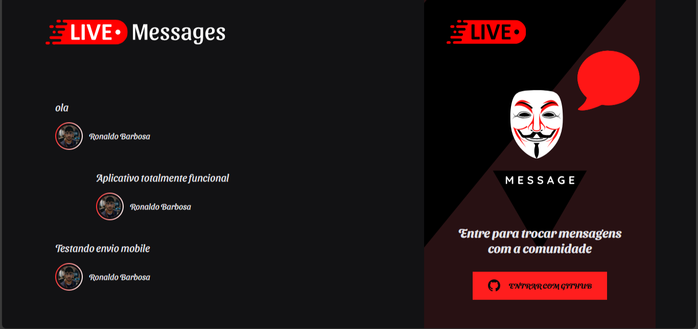

# Live-web — Chat em tempo real com Login GitHub (React, Vite, TS, Socket.IO)

Aplicação front-end em React + TypeScript com autenticação via GitHub OAuth e comunicação em tempo real usando Socket.IO. O app exibe as 3 últimas mensagens, recebe novas em tempo real e permite o envio de mensagens para a comunidade. Build rápido com Vite e estilos com SCSS Modules.

## 🔎 Visão geral

- SPA desenvolvida em React 17 + TypeScript
- Autenticação via GitHub OAuth (fluxo com `code`)
- API em `http://localhost:4000` (Axios + Socket.IO)
- Componentização clara: Login, Lista de Mensagens, Formulário de Envio
- Context API para estado global de autenticação

## ✨ Funcionalidades

- Login com GitHub (SSO) e persistência de token no `localStorage`
- Exibição das 3 últimas mensagens na entrada do app
- Recebimento de novas mensagens em tempo real via Socket.IO (`new_message`)
- Envio de mensagens autenticado (`POST /messages`)
- Perfil do usuário (avatar, nome, login) e botão de logout
- UI com SCSS Modules e ícones via `react-icons`

## 🧱 Stack e destaques técnicos

- React 17, TypeScript, Vite 2
- Axios para HTTP, Socket.IO Client para tempo real
- SCSS Modules para estilos isolados
- Context API para autenticação (token + perfil)
- Estrutura de pastas simples e escalável

## 🗺️ Arquitetura (pastas principais)

- `src/contexts/auth.tsx`: fluxo de login GitHub, token e perfil do usuário
- `src/services/api.ts`: cliente Axios com `baseURL` do backend
- `src/components/LoginBox`: CTA de login com GitHub
- `src/components/MessageList`: feed e listener do Socket.IO
- `src/components/SendMessageForm`: formulário autenticado e logout
- `src/styles`: estilos globais; `*.module.scss` para módulos

## 🔌 Integração com backend

Endpoints e eventos usados:

- `POST /authenticate/web` — troca `code` do GitHub por `token` + `user`
- `GET /profile` — retorna dados do usuário autenticado
- `GET /messages/Last3` — retorna as 3 últimas mensagens
- `POST /messages` — envia uma nova mensagem (requere auth)
- Evento Socket.IO: `new_message` — entrega mensagens em tempo real

URLs atuais no código:

- Axios: `src/services/api.ts` → `baseURL: http://localhost:4000`
- Socket.IO: `src/components/MessageList/index.tsx` → `io("http://localhost:4000/")`

> Dica: para produção, é recomendado parametrizar via `.env` do Vite, por exemplo:

```bash
VITE_API_URL=http://localhost:4000
VITE_SOCKET_URL=http://localhost:4000
```

e usar `import.meta.env.VITE_API_URL` no Axios e `VITE_SOCKET_URL` no Socket.IO.

## ▶️ Como rodar localmente

Pré‑requisitos:

- Node.js LTS
- Backend rodando em `http://localhost:4000` com os endpoints acima e Socket.IO habilitado
- App GitHub OAuth configurado (o `client_id` é referenciado no front)

No Windows PowerShell:

```powershell
# Instalar dependências
npm install

# Rodar o servidor de desenvolvimento (Vite)
npm run dev
```

Abra a URL que o Vite informar (ex.: `http://localhost:5173`). Faça login com GitHub, autorize o app e utilize o chat.

## 🧩 Estrutura do projeto (visão rápida)

```
index.html
package.json
tsconfig.json
vite.config.ts
src/
	App.module.scss
	App.tsx
	main.tsx
	vite-env.d.ts
	assets/
	components/
		LoginBox/
			index.tsx
			styles.module.scss
		MessageList/
			index.tsx
			styles.module.scss
		SendMessageForm/
			index.tsx
			styles.module.scss
	contexts/
		auth.tsx
	services/
		api.ts
	styles/
		global.css
```

## 🧠 Desafios e soluções

- OAuth com `code`: captura do `?code=`, limpeza de URL com `history.pushState`, troca por token e persistência segura
- Estado global de auth: Context API com preparação de headers do Axios
- Tempo real estável: fila local de mensagens + atualização em cadência para evitar saltos visuais
- Gestão de dependências: padronização no npm e remoção de libs incompatíveis/não usadas


## 🏷️ Tags para portfólio

React, TypeScript, Vite, SPA, OAuth, GitHub Login, Socket.IO, WebSockets, Axios, SCSS Modules, Front-end, Real-time, Chat, Context API, Single Page Application.

## 📌 Próximos passos (sugestões)

- Parametrizar URLs via `.env` e ajustar Axios/Socket.IO
- Adicionar README com GIFs de uso (login, recebimento em tempo real, envio)
- Tratamento de erros e toasts
- Testes unitários e integração; checagem de tipos mais estrita
- Deploy (Vercel/Netlify) apontando para backend hospedado

## 🖼️ Screenshot / Preview




